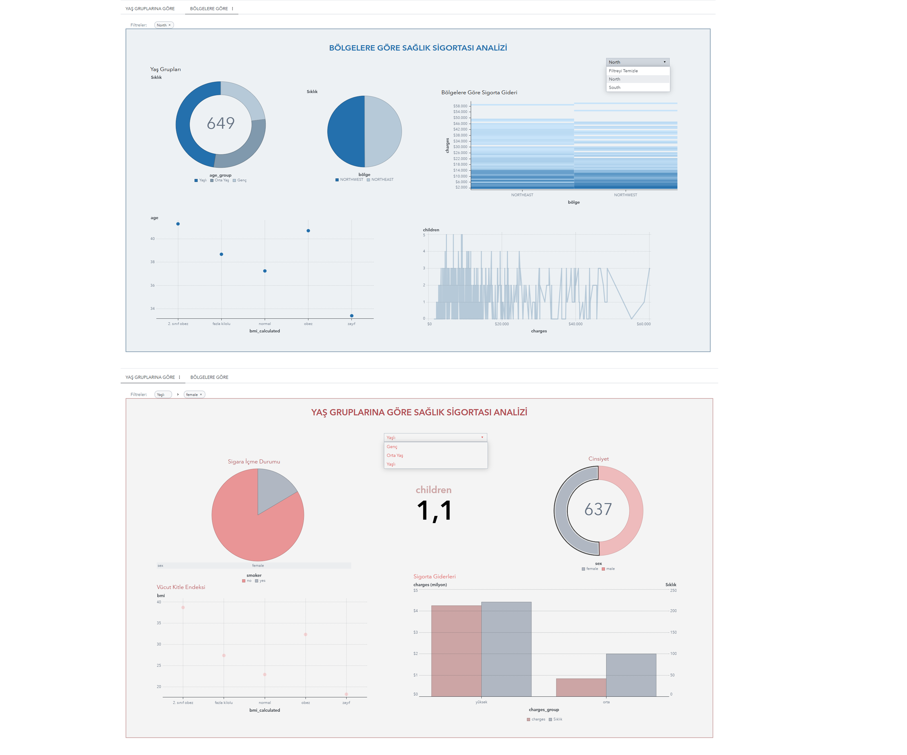

# Insurance Data Analysis using SAS

## 📊 Project Overview
This project focuses on analyzing an insurance dataset using SAS. The main goal is to clean the data, perform feature engineering, and generate business insights through segmentation and reporting.

## 🧑‍💼 Internship Context
This project was developed during my internship, where I worked on insurance data analysis and reporting using SAS tools.

## 🛠️ Tools & Technologies
- SAS (Viya / Base SAS)
- PROC SQL
- Data Cleaning & Transformation
- Feature Engineering
- Data Reporting

## 📁 Dataset
The original dataset is the Medical Insurance dataset from Kaggle.  
A sample dataset is included in this repository for demonstration purposes.

## 🔄 Project Workflow
- Imported and explored dataset using SAS
- Handled missing values
- Performed data cleaning and transformation
- Created new features such as:
  - Age groups
  - BMI categories
  - Insurance charge segmentation
- Applied conditional logic (CASE WHEN) for business classification
- Prepared dataset for reporting and dashboard creation

## 📈 Key Insights
- Insurance charges are strongly affected by BMI and smoking status
- Age segmentation helps identify risk groups
- Data transformation improves business interpretability

## 📊 Dashboard

The dashboard shows insurance cost distribution, risk segmentation, and key demographic insights.

## 🚀 Outcome
This project demonstrates practical experience in data analysis, feature engineering, and business reporting using SAS.
